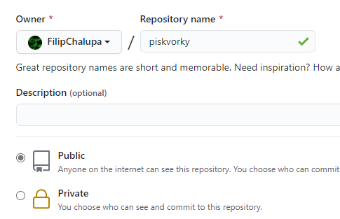
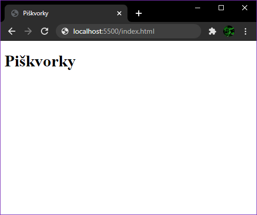
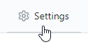
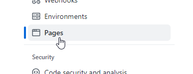
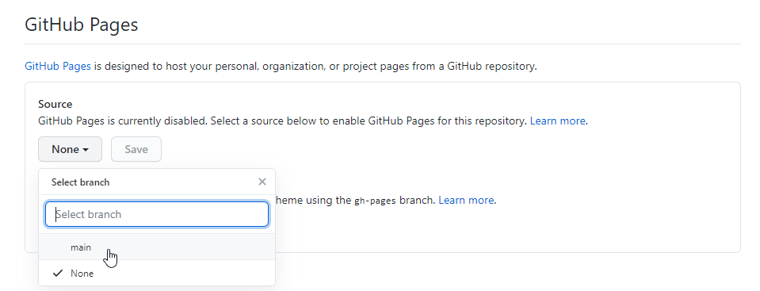
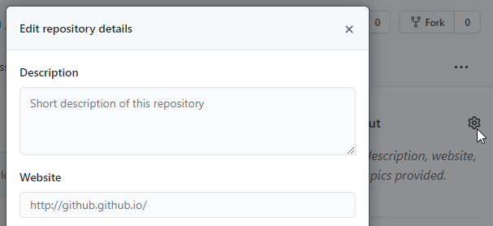
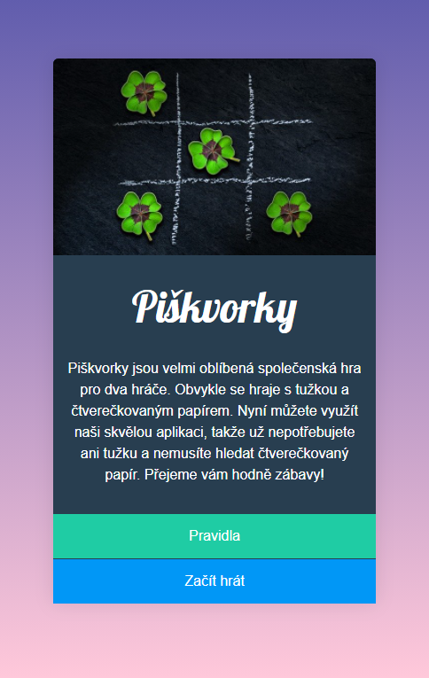
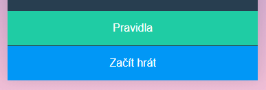

# Úkol: Piškvorky 1/5

Toto je první ze série pěti úkolů, ve kterých si postupně naprogramuješ hru piškvorky.

## Zadání

1. Pokud nemáš na [github.com](https://github.com/) účet, založ si jej.

1. Ve svém účtu vytvoř nový veřejný repozitář pojmenovaný `piskvorky`, do kterého budeš průběžně nahrávat svoji práci.

   

1. Repozitář si naklonuj do počítače spuštěním `git clone https://github.com/{DOPLŇ_TVŮJ_USERNAME}/piskvorky.git` na příkazové řádce, v terminálu. Vytvoří se ti složka `piskvorky`.

1. V této složce založ soubor `index.html`.

1. Do `index.html` přidej základní strukturu HTML a mezi značky `<body></body>` vlož nadpis úrovně `h1` s textem `Piškvorky`. Výsledek by měl vypadat takto:

   

1. Příkazem `git add .` vyber nově vytvořený HTML soubor a s `git commit -m "Základní html"` dokonči první commit.

1. Přes `git push` nahraj první commit na github.

1. Zkontroluj, že na adrese `https://github.com/{DOPLŇ_TVŮJ_USERNAME}/piskvorky` je nahraný `index.html`.

1. V nastavení povol GitHub Pages.

   

   

   

1. Odkaz na stránku přidej do popisku repozitáře v sekci Website.

   

1. Vedle souboru `index.html` vytvoř i `styly.css` a napoj je do stránky pomocí tagu `<link … />`.

1. Do stejné složky si stáhni obrázek [uvodni.jpg](https://github.com/Czechitas-podklady-WEB/Ukol-Piskvorky-1/raw/main/podklady/uvodni.jpg).

1. Postupnou úpravou HTML a CSS uprav stránku do této podoby:

   

1. Nezapomeň průběžně commitovat a nahrávat na GitHub.

   1. Proveď změny. Uprav soubory. Napiš HTML, CSS.
   1. Pomocí `git add .` označ všechny nové změny.
   1. Přes `git commit -m "Název změn"` pojmenuj, čeho se změny týkají.
   1. S `git push` nahraj commit na Github.
   1. Vrať se do prvního kroku.

1. Pro spodní dvě tlačítka použij tag `<a>`.

   1. Prvnímu tlačítku, odkazu na pravidla nastav atribut `href="https://czechitas-podklady.cz/Piskvorky-pravidla/"`.
   1. Druhému nastav atribut `href="index.html"`. Bude tedy prozatím odkazovat na stránku, kde zrovna uživatel je. Stránku s hrou totiž doplníte až v dalších úkolech.

1. Tlačíka by se po najetí myši měly ztmavit.

   

### Poznámky ke grafice

- Nadpis Piškvorky je fontem `Lobster`. Najdeš ho zdarma na Google Fonts.
- Různé vzdálenosti, velikosti textu odhadni od oka nebo přesně změř na obrázku výše.
- Gradient v pozadí jde z fialové  `#615dad` do růžové  `#ffc8da`.
- Další barvy, které se ti budou hodit:
  - Barva textu  `#ffffff`.
  - Podkladová tmavě modrá  `#283e50`.
  - Tlačítko Pravidla  `#1fcca4`. A po najetí myši  `#1cbb96`.
  - Tlačítko Začít hrát  `#0197f6`. Po najetí  `#0090e9`.
- Úvodní text nemusíš opisovat. Stačí ho zkopírovat zde: `Piškvorky jsou velmi oblíbená společenská hra pro dva hráče. Obvykle se hraje s tužkou a čtverečkovaným papírem. Nyní můžete využít naši skvělou aplikaci, takže už nepotřebujete ani tužku a nemusíte hledat čtverečkovaný papír. Přejeme vám hodně zábavy!`
